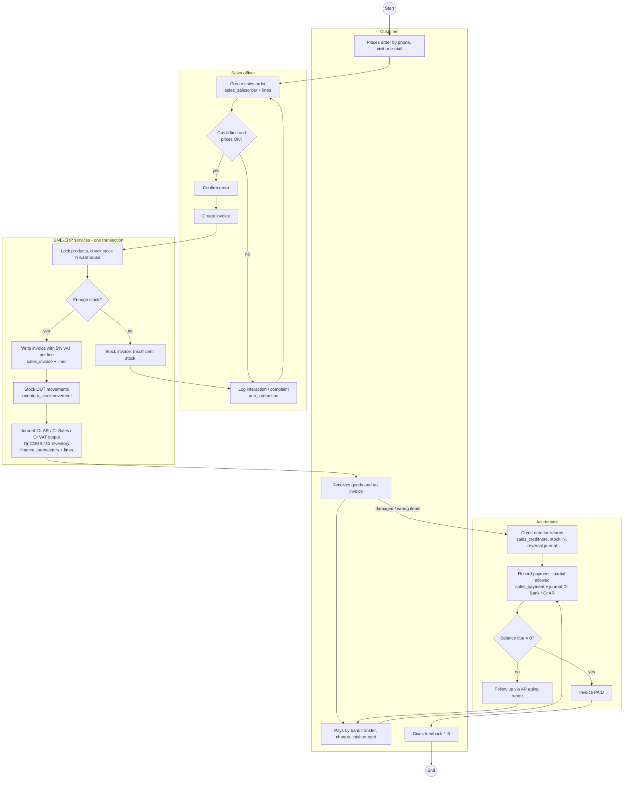

# Activity Diagram – Order to Cash

Report reference: §3.6 (behavioural models: activity diagrams). Swimlanes are shown as subgraphs; the
tables written by each step are in brackets.

```mermaid
flowchart TB
    start((Start))
    subgraph CUST[Customer]
        c1[Places order by phone, visit or e-mail]
        c2[Receives goods and tax invoice]
        c3[Pays by bank transfer, cheque, cash or card]
        c4[Gives feedback 1-5]
    end
    subgraph SALES[Sales officer]
        s1[Create sales order<br/>sales_salesorder + lines]
        s2{Credit limit and<br/>prices OK?}
        s3[Confirm order]
        s4[Create invoice]
        s5[Log interaction / complaint<br/>crm_interaction]
    end
    subgraph ERP[SME-ERP services - one transaction]
        e1[Lock products, check stock in warehouse]
        e2{Enough stock?}
        e3[Write invoice with 5% VAT per line<br/>sales_invoice + lines]
        e4[Stock OUT movements<br/>inventory_stockmovement]
        e5[Journal: Dr AR / Cr Sales / Cr VAT output<br/>Dr COGS / Cr Inventory<br/>finance_journalentry + lines]
        e6[Block invoice: Insufficient stock]
    end
    subgraph ACC[Accountant]
        a1[Record payment - partial allowed<br/>sales_payment + journal Dr Bank / Cr AR]
        a2{Balance due = 0?}
        a3[Invoice PAID]
        a4[Follow up via AR aging report]
        a5[Credit note for returns<br/>sales_creditnote, stock IN, reversal journal]
    end
    finish((End))

    start --> c1 --> s1 --> s2
    s2 -- no --> s5 --> s1
    s2 -- yes --> s3 --> s4 --> e1 --> e2
    e2 -- no --> e6 --> s5
    e2 -- yes --> e3 --> e4 --> e5 --> c2
    c2 -- damaged / wrong items --> a5 --> a1
    c2 --> c3 --> a1 --> a2
    a2 -- no --> a4 --> c3
    a2 -- yes --> a3 --> c4 --> finish
```
